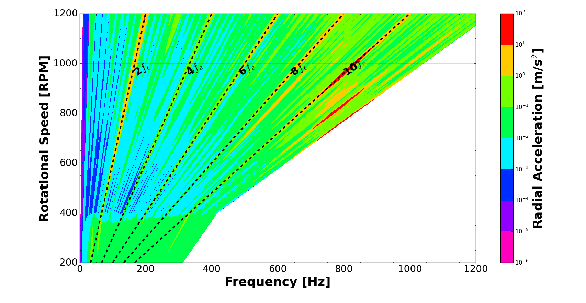
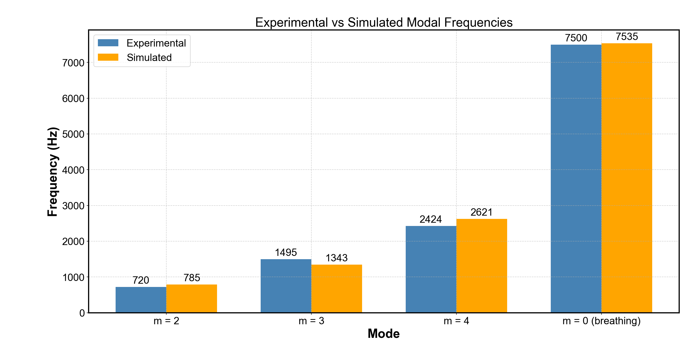
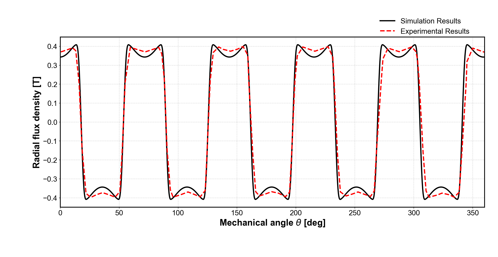

# NVH Analysis of Permanent Magnet Synchronous Machine

This project presents a multi-physics analysis of electromagnetic noise and vibration in a PMSM.

## 🔍 Overview
- Electromagnetic forces computed using ANSYS Maxwell
- Structural response via harmonic analysis
- Validation with experimental benchmark data

## 📊 Results

### Spectrogram_Simulated_Result

### Spectrogram_Experimental_Result

### Modal Comparison

### Radial Flux Density

## 📄 Documents
- [Poster](docs/poster.pdf)
- [Report](docs/report.pdf)

## ⚙️ Tools Used
- ANSYS Maxwell
- ANSYS Mechanical
- Python (NumPy, Matplotlib)

---
